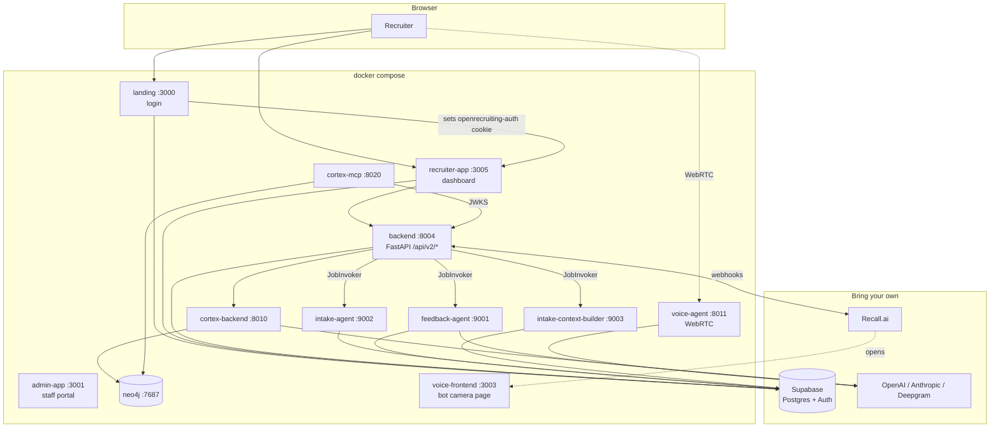

# Architecture

Twelve containers, one `.env`, and three cloud services you bring yourself.

## The stack



## Auth

Login lives in **landing**; the dashboard lives in **recruiter-app**. They share
one Supabase session through the `openrecruiting-auth` cookie:

1. Unauthenticated request to `recruiter-app` → 307 to `landing/login?redirect=…`
2. Landing authenticates against Supabase and sets the cookie
3. Recruiter-app's middleware reads it and lets the request through
4. The backend verifies the JWT on every API call

Two things make or break this handoff:

- **`@supabase/ssr` must be the exact same version in both apps** (`0.8.0`). A
  mismatch changes the cookie encoding and produces an infinite redirect loop.
- **`NEXT_PUBLIC_COOKIE_DOMAIN` stays blank on localhost.** The apps differ only
  by port, so a host-scoped cookie is what you want. Set it only when serving
  them from sibling subdomains.

## Background jobs

Three workers began life as AWS Lambdas. They still contain their Lambda
handlers unchanged; only the trigger differs, chosen by `JOB_INVOKER`:

| Value | Transport |
|---|---|
| `http` (default) | `HttpInvoker` POSTs the Lambda-shaped event to the worker container |
| `lambda` | `LambdaInvoker` invokes via boto3, for an AWS deployment |

There are four logical job targets, and two of them are easy to confuse:

| Target | Worker | Payload |
|---|---|---|
| `feedback` | feedback-agent | `{candidate_round_id}` |
| `intake` | intake-agent | `{session_id}` — the recruiter's self-serve intake |
| `context_builder` | intake-context-builder | `{session_id, include_turns}` |
| `intake_transcript` | *not shipped* | `{requisition_id}` — an older staff tool |

`intake_transcript` has no default URL on purpose: it raises rather than posting
a `requisition_id` to a worker that expects a `session_id`.

`/invoke` is serialised per container with a semaphore. AWS runs one invocation
per container at a time and these handlers rely on it — they cache loop-bound
async clients in module globals and tear them down in a `finally`. Concurrent
requests in one process would let two invocations close each other's clients.

## Data

Supabase Postgres with row-level security is the system of record.
`schema.sql` is the whole thing squashed into one idempotent file.

Neo4j holds the recruiting knowledge graph: candidates, requisitions, rounds,
skills and the relationships between them. It is filled from Postgres: triggers
on the source tables append to `cortex_events`, a work ledger that
`cortex-backend` polls, claims in leased batches, and ingests into Neo4j,
recording the result of each event in `cortex_ingestion_record`. The graph is
read by `cortex-mcp` (which lets an MCP client ask questions in Cypher,
validated and tenant-scoped).

## Meeting capture

Recall.ai is cloud-only and calls **you**, so it needs a publicly reachable URL:

```
Recall bot joins → records → POSTs to WEBHOOK_BASE_URL/api/v2/webhooks/recall/bot-status
  → backend stores the transcript
  → backend dispatches the feedback job
  → feedback-agent scores it and writes back to Supabase
```

Locally that means a tunnel (`ngrok http 8004`). Without one everything else
still works; you just never get the callback. See
[`setup/recall.md`](setup/recall.md).

## Degrading without keys

Every external dependency is optional except Supabase. Absent keys disable a
feature rather than breaking the stack:

| Missing | Effect |
|---|---|
| `OPENAI_API_KEY` | Embeddings unavailable, so graph ingestion degrades; cortex-backend still serves and reports healthy |
| `RECALL_API_KEY` | Meeting capture off; `recall_enabled` is false |
| `WEBHOOK_BASE_URL` | Bots record but callbacks never arrive |
| `DEEPGRAM_API_KEY` | Voice agent starts but cannot transcribe |
| `MCP_JWT_PRIVATE_KEY_PEM` | MCP discovery returns 503 "not configured" |

## Ports

| Port | Service |
|---|---|
| 3010 | setup-ui (127.0.0.1 only — configures the stack from a browser) |
| 3000 | landing |
| 3001 | admin-app (staff only) |
| 3003 | voice-frontend |
| 3005 | recruiter-app |
| 7474 / 7687 | neo4j browser / bolt |
| 8004 | backend |
| 8010 | cortex-backend |
| 8011 | voice-agent (+ 40000-40010/udp for media) |
| 8020 | cortex-mcp |

The three workers are internal-only — they use `expose`, not `ports`, so nothing
outside the compose network can reach them.

On Linux you can give the voice agent host networking for a better media path:

```bash
docker compose -f docker-compose.yml -f docker-compose.linux.yml up -d
```

That does not work on Docker Desktop for macOS or Windows, which is why the
default is explicit port mappings.
